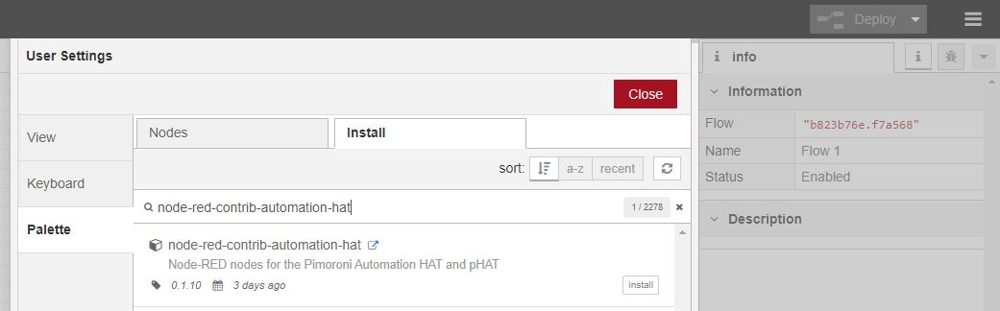

# Node-RED nodes for Pimoroni Automation HAT/pHAT


## Provides nodes

* Automation HAT:
  * Output Node:
    * Sinking Outputs
    * Relays (1-3 on HAT and 1 only on pHAT)
    * Lights (not on pHAT)
  * Input Node (triggered based on change in input):
    * Buffered Inputs (binary)
    * Analog ADC 1-3 - 12-bit ADC @ 0-25.85V (±2% accuracy)
    * Analog ADC 4 - 12-bit ADC @ 0-3.3V (not on pHAT)
  * Reader Node:
    * On demand reading of input nodes

### Unsupported features

* Other Pins exposed only break out section: SPI, TX (#14), RX (#15), #25 pins
* Controlling individual indicator lights on each input/output beyond the auto_lights capability.

## More Information

More information and examples of using this node can be found in my blog post [www.martinrowan.co.uk](https://www.martinrowan.co.uk/2018/09/node-red-support-for-pimoroni-automation-hat-phat/). Hopefully this will provide some inspiration.

### Where to buy

* [Pimoroni Automation HAT](https://shop.pimoroni.com/products/automation-hat)
* [Pimoroni Automation pHAT](https://shop.pimoroni.com/products/automation-phat)

## Installation

### Dependency - Node and Node-Red

Details of how to install Node and Node-Red needed for this project on Raspberry Pi can be found [here](https://nodered.org/docs/hardware/raspberrypi). The script at the top of the page ensures you have the latest supported versions ready for this project.

### Dependency - Automation HAT Python Library

First you'll need the Python dependencies for Automation HAT, you can install these with our one-line installer, [as per these instructions](https://github.com/pimoroni/automation-hat)

``` bash
curl https://get.pimoroni.com/automationhat | bash
```

### Automation HAT Node-RED

#### Installation via Node-Red

Run Node-Red and open setting menu, and select Manage palette. Select the install tab, and enter `node-red-automation-hat`



#### Installation via NPM

``` bash
npm install node-red-contrib-automation-hat
```

After installing via `npm` you will need to restart Node-Red

#### Installation from latest source on GitHub

To install this node you should:

* Change to your users node-red nodes directory:

    ``` bash
    cd ~/.node-red/node_modules
    ```

    _Note: older node installation may use the location: `~/.node-red/nodes`):_
* Clone this repository:

    ``` bash
    git clone https://github.com/shortbloke/node-red-contrib-automation-hat
    ```

* Start Node-Red and you should see the new Automation HAT nodes within the Raspberry Pi section.

## References

This project is based on the [ExplorerHAT node implementation published by Pimoroni](https://github.com/pimoroni/node-red-nodes).
